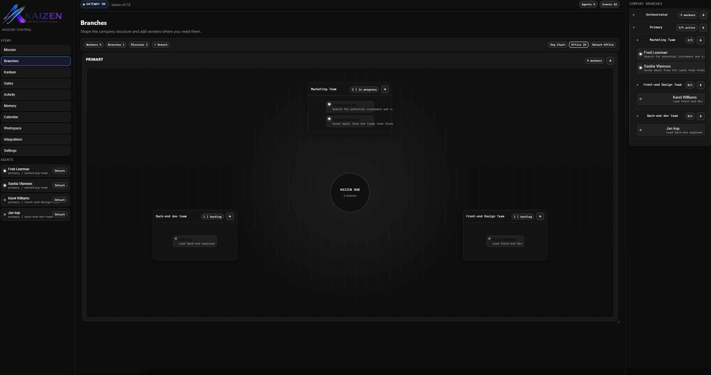
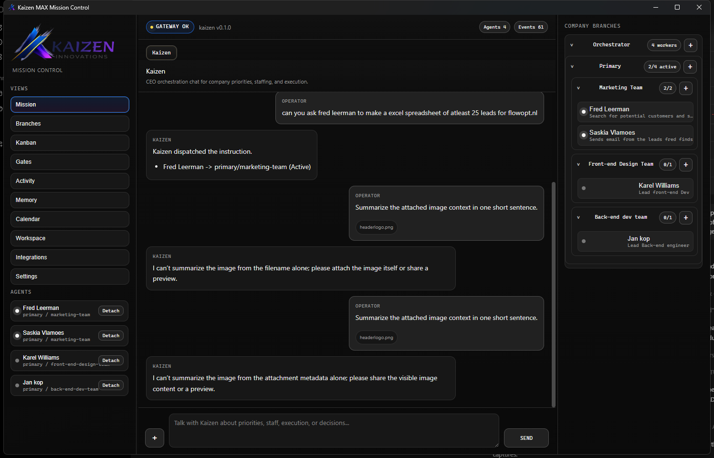
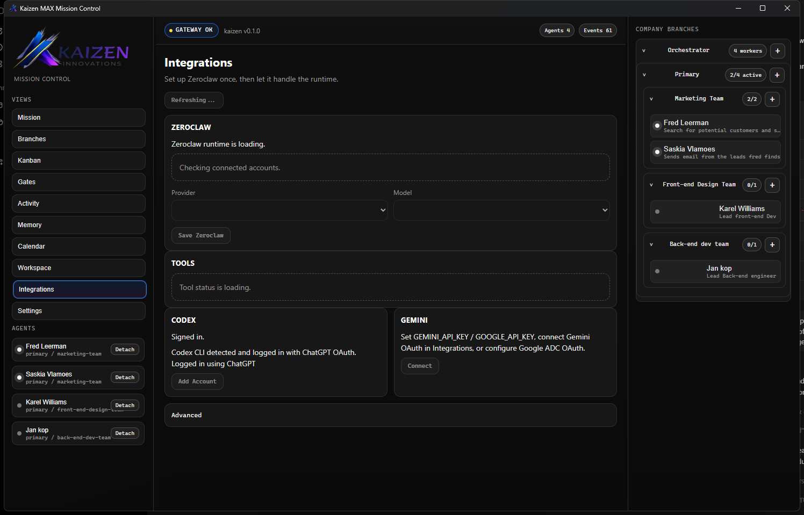

# Kaizen MAX

Kaizen MAX is a Rust-first desktop control surface for AI-assisted operations. It combines a native desktop interface, a Rust gateway, persistent worker orchestration, and a practical tool runtime under Zeroclaw.

`main` is the public release branch.

  

<strong>Office View</strong>: branches, missions, workers, and runtime status in one operator surface.

## What It Does

- executive-style Kaizen chat for planning, delegation, and review
- persistent `Branch -> Mission -> Worker` orchestration
- detachable worker chats and detachable office view
- background worker runner with heartbeats and job state
- provider routing through Zeroclaw
- native tool runtime for Gmail, reports, and lead research
- Crystal Ball event logging with optional Mattermost publishing
- release update checks against `origin/main`

## Product Views

### Mission

### Integrations

### Office

## Architecture Summary

Kaizen MAX has two main runtime layers:

- `core/`: Rust gateway, orchestration runtime, persistence, events, tools, inference
- `ui-rust-native/`: Rust-native desktop application built with Tauri and Leptos

The desktop UI is the operator surface. The gateway is the source of truth.

## Zeroclaw

Zeroclaw is the runtime control plane for:

- provider selection
- model routing
- provider readiness
- native tool status
- worker tool execution

Zeroclaw is no longer just a provider alias. It now exposes native business tools and worker execution state. OpenClaw remains a limited compatibility bridge, not the primary runtime.

## Native Tools

Current native Zeroclaw tools:

- `gmail`: app-managed Google OAuth for Gmail draft/send flows
- `reports`: CSV and XLSX artifact export under `data/worker_artifacts/`
- `leads`: website-level lead research with structured exports

Current transitional tool paths:

- selected OpenClaw fallback tools for missing local capabilities

## Runtime Paths

Supported inference paths:

- `codex-cli`
- `openai`
- `anthropic`
- `gemini`
- `nvidia`
- `gemini-cli`

Current auth modes:

- Codex CLI: local browser login via `codex login`
- OpenAI / Anthropic / NVIDIA: API keys
- Gemini: app-managed Google OAuth, API key, or ADC fallback
- Gmail: app-managed Google OAuth
- Gemini CLI: local CLI login

## Quick Start

### Launch

Use one of:

- `scripts\\launch-kaizen-max.ps1`
- `scripts\\start-max.ps1`
- the desktop shortcut if you created one

### First-use setup

1. Launch the desktop app.
2. Open `Integrations`.
3. Connect the provider Zeroclaw should use.
4. Connect Gmail if you want native mail actions.
5. Return to `Mission` and work through Kaizen chat.

## Build and Validation

### Core

- `cd core`
- `cargo test`

### Desktop frontend

- `cd ui-rust-native`
- `cargo check --target wasm32-unknown-unknown --manifest-path frontend/Cargo.toml`
- `cargo tauri build`

## Repository Layout

- `core/` - gateway, orchestration, persistence, tools, events, inference
- `ui-rust-native/` - Rust-native Mission Control desktop app
- `scripts/` - launcher and updater scripts
- `config/` - settings defaults and schema
- `contexts/` - prompts and runtime policy templates
- `docs/` - public screenshots and technical notes
- `protocol/` - protocol-facing notes
- `compat/` - compatibility notes

## Public Documentation

- [ARCHITECTURE.md](ARCHITECTURE.md)
- [STRUCTURE.md](STRUCTURE.md)
- [ROADMAP.md](ROADMAP.md)
- [VISION.md](VISION.md)

## Current Boundaries

- OpenClaw compatibility is selective, not full parity
- Gmail works through app-managed OAuth, but still depends on Google credentials you provide
- image attachments flow through the chat transport, but true image understanding still depends on the active provider path
- business tooling is active, but CRM integrations are not implemented yet

## Privacy and Repo Hygiene

This public branch is intended to contain product code and public-facing documentation only. Local planning notes, private delivery docs, runtime state, tokens, and machine-specific files are kept out of version control.
